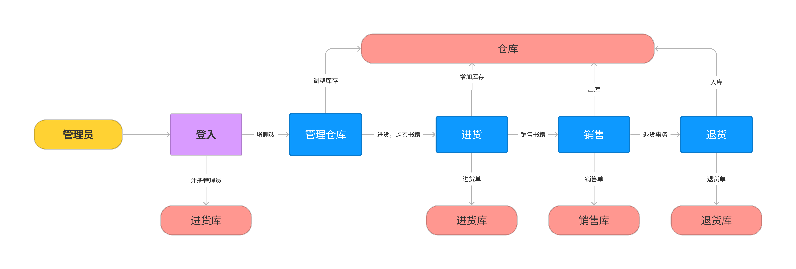

# 《数据库系统》课程设计报告

**题目：图书销售管理系统**

**小组成员信息：**

| 姓名 | 学号 |   班级   | 分工 |
| :--: | :--: | :------: | :--: |
|  陈  |      | 计科二班 |      |
|  郭  |      | 计科二班 |      |

​														提交时间：2022 年 12 月 30 日

## 一、开发环境与开发工具

 

## 二、系统需求分析(2分)

通过调研书店图书销售业务，分析需求如下：

- 用户管理：对系统用户——书店客户、系统管理员等相关信息进行管理
- 图书管理：管理员通过系统能够方便的添加、修改、删除、维护图书信息。
- 进货：根据书籍的库存量及销售情况确定进货数量。输出进货单并且自动修改库存量，将进货信息添加到进货库中。
- 退货：输出退货单并自动修改库存量，将退货信息添加到退货库中
- 销售：通过输入顾客要买书的信息，显示数据库存量。如果可以销售，输出销售单并修改库存量，将本次销售的有关信息添加到日销售库中
- 统计信息：自动计算每月销售总额，销售总量；输出销售状况报表，按照销量整理销量排行榜

### 系统数据字典

#### 数据结购&数据项

##### 顾客

| 编号 | 数据结构 | 描述 | 属性                                 |
| :--: | :------: | :--: | ------------------------------------ |
|  1   |   user   | 顾客 | 用户编号、用户名、用户电话、用户密码 |

|  数据项  |   名字   | 描述                 | 定义   |
| :------: | :------: | -------------------- | ------ |
|  userID  | 用户编号 | 每一位用户有唯一编号 | string |
| userName | 用户姓名 |                      | string |
|  phone   |   电话   | 用户电话号码         | string |
| password | 用户密码 | 创建时用户自行输入   | string |

##### 管理员

| 编号 | 数据结构 |  描述  | 属性                                   |
| :--: | :------: | :----: | -------------------------------------- |
|  2   |  admin   | 管理员 | 管理员编号、用户名、用户电话、用户密码 |

|  数据项  |    名字    | 描述                 | 定义   |
| :------: | :--------: | -------------------- | ------ |
| adminID  | 管理员编号 | 每一位用户有唯一编号 | string |
| userName |  用户姓名  |                      | string |
|  phone   |    电话    | 用户电话号码         | string |
| password |  用户密码  | 创建时用户自行输入   | string |

##### 书籍信息

| 编号 | 数据结构 |   描述   | 属性                                                   |
| :--: | :------: | :------: | ------------------------------------------------------ |
|  3   |   book   | 图书信息 | ISNB、书名、作者、开本、出版设名、进价、售价、库存数量 |

|   数据项   |   名字   | 描述                   | 定义   |
| :--------: | :------: | ---------------------- | ------ |
|  book_id   | ISBN编号 | 国际标准书号(13位数字) | string |
|    name    |   书名   | 书籍名字               | string |
|   author   |   作者   | 作者姓名               | string |
|    size    |   开本   | 书籍大小               | int    |
| publisher  |  出版社  | 出版社名称             | string |
| purchasing |   进价   | 书籍购买价格           | float  |
|  selling   |   售价   | 书籍出售价格           | float  |
|   number   | 库存数量 | 当前库存数量           | int    |

##### 进货库

| 编号 | 数据结构 |  描述  | 属性                       |
| :--: | :------: | :----: | -------------------------- |
|  4   | purchase | 进货库 | 进货单号，入库日期、进货单 |

|  数据项   |   名字   | 描述                             | 定义              |
| :-------: | :------: | -------------------------------- | ----------------- |
| puchaseID | 进货单号 | 每次进货产生唯一单号             | string            |
|   date    | 入库日期 | 本次进货入库日期                 | date              |
|   bill    |  进货单  | 进货单据，包含进货详细目录、凭证 | txt文件（待斟酌） |

##### 退货库

| 编号 | 数据结构 |  描述  | 属性                       |
| :--: | :------: | :----: | -------------------------- |
|  5   |  return  | 退货库 | 退货单号，入库日期，退货单 |

|  数据项  |   名字   | 描述                             | 定义              |
| :------: | :------: | -------------------------------- | ----------------- |
| returnID | 退货单号 | 每次退货产生唯一单号             | string            |
|   date   | 入库日期 | 本次退货日期                     | date              |
|  proof   |  退货单  | 退货单据，包含退货详细目录、凭证 | txt文件（待斟酌） |

##### 销售库

| 编号 | 数据结构 |  描述  | 属性                       |
| :--: | :------: | :----: | -------------------------- |
|  6   |   sale   | 销售库 | 销售单号，出库日期，销售单 |

| 数据项  |      名字      | 描述                       | 定义              |
| :-----: | :------------: | -------------------------- | ----------------- |
| saleID  |    销售单号    | 每次售货产生唯一单号       | string            |
|  date   |    出库日期    | 出售日期                   | date              |
| invoice | 销售单（发票） | 销售单据，包含售货详细目录 | txt文件（待斟酌） |

#### 数据流

#### 数据存储

- 数据存储名：书籍库存表；
- 说明：书籍信息数据，全部书籍信息与书籍库存信息；
- 输入的数据流：进货单数据流、退货单数据流、来自管理员相关操作；
- 输出的数据流：销售单数据流，用于销售部门销售；
- 数据结构：“图书信息”
- 存取频度：每小时存取更新10~20次，查询大于等于100次；
- 存取方式：联机处理、检索与更新。

#### 处理过程

处理过程名：实时图书库存计算

- 说明：随着进货入库、销售出库的不断操作，要能实时计算出当前产品的库存；
- 输入：进货信息、销售信息、退货信息；
- 输出：计算出各图书当前库存；
- 处理：产品库存计算的功能就是实时计算产品的库存，处理频度：每当有出入库数据流发生都要引发库存计算事务。

处理过程名：月销售额结算

- 说明：当管理员需要是启动结算功能，计算最近一个月的销售总额；
- 输入：进货信息、销售信息、退货信息；
- 输出：最近应该月的销售总额；
- 处理：产品库存计算的功能就是不定时计算销售总额，处理频度：每当管理员触发功能。

## 三、功能需求分析（3分）

### 管理员方面功能需求

- 基本管理：对于系统用户增添、删除、修改信息；查阅进货库、销售库的详细信息；对于书籍信息、库存信息增删查改；
- 进货：使管理员可以方便的选择要进货的书籍，输出进货单详细记录进货信息并且自动修改库存量，将进货信息添加到进货库中；
- 退货：使管理员可以检查所退产品的销售单符合，输出退货单并自动修改库存量，将退货信息添加到退货库中；
- 销售：管理员通过输入顾客要买书的信息，显示数据库存量。如果可以销售，输出销售单并修改库存量，将本次销售的有关信息添加到日销售库中；
- 统计信息：管理员可以一键自动计算月销售总额，销售总量；输出销售状况报表。可一键更新销量排行榜。

### 顾客需求

- 查询：顾客可根据部分详细例如数目、作者查找相关书籍详细信息以及库存；
- 浏览：顾客可以浏览主页书籍展示，以及本书店的销售排行榜；
- 购书：顾客可将书籍加入购物车，方便购买。

### 系统功能模块图

.png)

## 四、系统设计（10分）

数据概念结构设计（系统ER图）（5分）

数据库关系模式设计（3分）

数据库物理结构设计（2分）

 

## 五、系统功能的实现 (5分)

主要功能模块的实现过程（简述）、运行界面

 

## 六、总结

  本课程设计中用到的《数据库系统》理论课概念与知识。